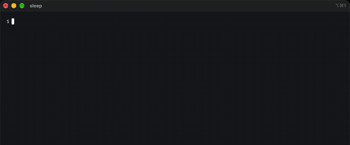

# jev-enforce

[](https://www.npmjs.com/package/jev-enforce)
[](https://www.npmjs.com/package/jev-enforce)
[](LICENSE)
[](https://github.com/sponsors/erkamyaman)

Claude Code plugin that checks every reply and every file edit against your CLAUDE.md (or AGENTS.md), using TypeSafe's Jev. Break a rule and Claude gets it quoted back and fixes it, in the same turn.



<sub>The handler it is checking is <a href="demo/src/orders.ts">demo/src/orders.ts</a>.</sub>

## Why

CLAUDE.md is context, not a constraint. It holds for a few turns, then a handler shows up with raw SQL in it and a test quietly becomes `it.skip`. Nothing checks the output against the rules, so this does.

Jev makes it cheap enough to run every turn: it answers typed yes/no questions instead of writing text, all of them in one request. One question per rule, about 350ms, about 3 cents per 1,000 checks.

## Try it

Nothing to install, Node 18+ and `npx` are enough:

```sh
npx jev-enforce check --as code src/orders.ts
```

## Install

```sh
claude plugin marketplace add erkamyaman/jev-enforce
claude plugin install jev-enforce@jev-enforce
```

Add your key (from [console.typesafe.ai](https://console.typesafe.ai)) to `~/.claude/settings.json`:

```json
{ "env": { "TYPESAFE_API_KEY": "..." } }
```

No key, no checks. It cannot break a session.

## How it works

- Reads the same rule files Claude Code does: `~/.claude/CLAUDE.md`, `CLAUDE.md`, `.claude/CLAUDE.md`, `CLAUDE.local.md`, `.claude/rules/**`, and `AGENTS.md` when the project has no CLAUDE.md, matching Claude Code's own precedence. Each bullet is one rule.
- Sorts each rule once, cached: does it constrain replies, code, both, or neither. Git and workflow rules land in neither and are skipped.
- A `Stop` hook checks the final reply. A `PostToolUse` hook checks Edit, Write and MultiEdit.
- Broken rules come back as `decision: "block"` with the rules quoted, so Claude fixes it before you see it. Once per turn, so it cannot loop.

## CLI

Installed as a plugin, or through `npx jev-enforce`:

```sh
jev-enforce rules                          # your rules and how each was sorted
jev-enforce check --as code src/orders.ts  # exits 1 if a rule is broken
jev-enforce check --as reply message.txt
```

The CLI reads `TYPESAFE_API_KEY` from the environment, so it works in CI as a rule check on changed files.

## Settings

| Env | Default | |
| --- | --- | --- |
| `TYPESAFE_API_KEY` | none | Required |
| `JEV_ENFORCE_THRESHOLD` | `0.7` | How sure Jev must be before Claude is told |
| `JEV_ENFORCE_OFF` | unset | `1` disables it |

## Benchmark

59 labeled examples against 19 rules, half style and half architecture and security. Full output in [bench/results.md](bench/results.md), reproduce with `npm run bench`.

| Threshold | Precision | Recall | Clean texts wrongly flagged |
| --- | --- | --- | --- |
| 0.6 | 87.8% | 95.6% | 3 of 28 |
| **0.7 (default)** | **93.3%** | **93.3%** | **2 of 28** |
| 0.8 | 95.3% | 91.1% | 2 of 28 |
| 0.9 | 97.4% | 84.4% | 1 of 28 |

348ms p50, $0.0027 for the whole run.

## What it is bad at

- Exact characters. It read `2019–2024` as an em dash.
- Dataflow. `prefer-const` rules need a linter, not a model.
- Rules that depend on state outside the text. "Never add an npm dependency" scored 0.56 on a new `axios` import, because it cannot see package.json. Editing an old migration scored 0.06.
- Your reply text, edits and rules go to TypeSafe's API.

## Development

```sh
npm install
npm test
```

TypeScript, no runtime dependencies, tests run offline against a fake Jev. `dist/src/` is committed because Claude Code runs plugin hooks straight from the repo, so run `npm run build` before committing (`npm run check-dist` verifies).

## Sponsor

If this saves you from one more "I told it not to do that" moment, you can [sponsor the work](https://github.com/sponsors/erkamyaman).

## License

MIT
